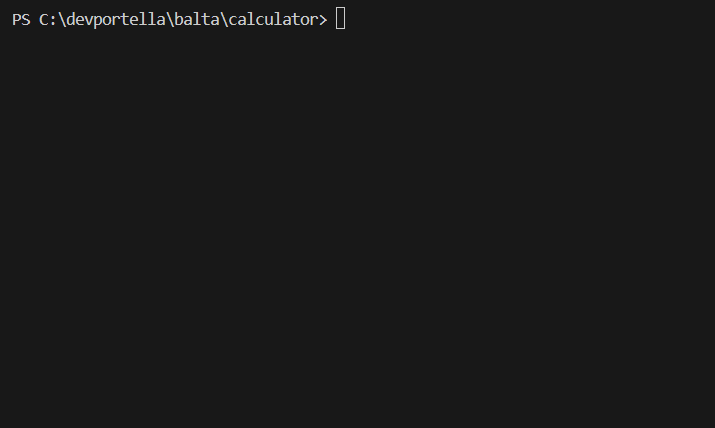

# Console Calculator (C#)

A simple console calculator that supports Add, Subtract, Divide, and Multiply.  
This project was originally started as part of an online C# training course and then further improved to practice coding and Git workflow.

<br>

<p align="left">
  
</p>

## How to run

Clone this repository and run the project with .NET:

```bash
git clone https://github.com/devportella/calculator.git
cd calculator
dotnet run
```

## What I learned

- How to build a simple console application in C#.
- The difference between handling a menu with recursion vs a loop.
- How to use Git for version control with commit messages.